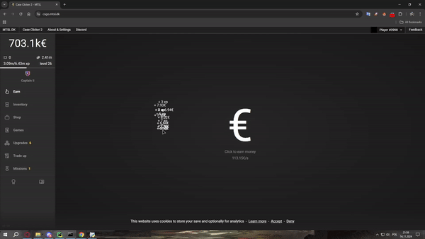

# Case Clicker 2 Automation Tool

This project is an automation tool for the game [Case Clicker 2](https://csgo.mtsl.dk), written in Python. It uses the `pyautogui` and `win32api` libraries to simulate mouse movements and clicks, as well as to detect objects on the screen.

## Features

1. **Automatic Clicking**: The tool simulates mouse clicks at a specified speed with random offsets to mimic human behavior.
2. **Object Detection**: The tool can detect various objects on the screen, such as boosters and money bags, and automatically move the cursor to them.
3. **Smooth Mouse Movements**: The tool simulates smooth mouse movements instead of moving the cursor directly to the target. Additionally, the mouse movements are slightly random to mimic natural human movements.
4. **Multithreading**: The tool uses multithreading to perform various tasks simultaneously, such as clicking, object detection, and checking if the earn menu is active.

## Code Structure

The project consists of several files:

- `main.py`: The main file that starts all threads.
- `clicking.py`: Contains functions to simulate mouse clicks and movements.
- `detection.py`: Contains functions to detect objects on the screen.
- `SmoothCursor.py`: Contains the `SmoothCursor` class that simulates smooth mouse movements.
- `constants.py`: Contains global variables used throughout the project.
- `utils.py`: Contains utility functions, such as checking if the earn menu is active.
- `gui.py`: Contains code responsible for the graphical user interface (GUI). The GUI is still under development.

## How to Use

1. Install the required libraries by running the following command in the terminal:

    ```sh
    pip install -r requirements.txt
    ```

2. Run the `main.py` file and let the tool automatically play Case Clicker 2 for you. You can stop and resume the tool by pressing the appropriate keys (default 'delete' and 'p').

The program fully shows its capabilities after a few minutes of gameplay when we can afford upgrades (boosters and money bags).

## Save File

A save file with unlocked upgrades is available in the `setup` folder. To use this save, go to "About & Settings" and then "Load Save" on the game's website.

## Showcase

